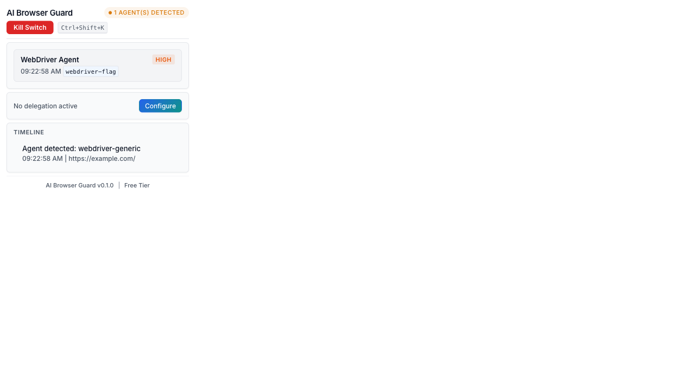
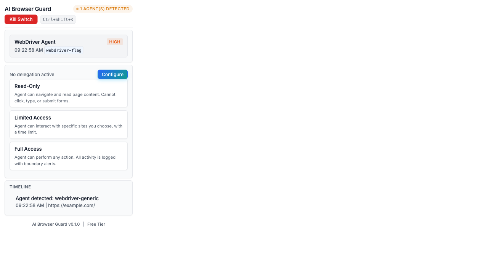
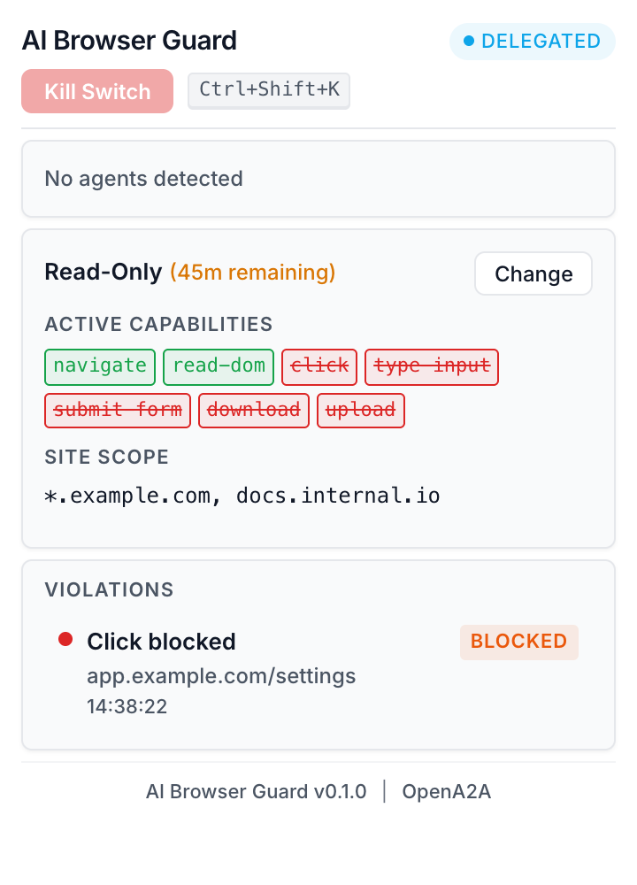

> **[OpenA2A](https://github.com/opena2a-org/opena2a)**: [Secretless](https://github.com/opena2a-org/secretless-ai) · [HackMyAgent](https://github.com/opena2a-org/hackmyagent) · [ABG](https://github.com/opena2a-org/AI-BrowserGuard) · [AIM](https://github.com/opena2a-org/agent-identity-management) · [OASB](https://github.com/opena2a-org/oasb) · [ARP](https://github.com/opena2a-org/arp) · [DVAA](https://github.com/opena2a-org/damn-vulnerable-ai-agent)

# AI Browser Guard

[](https://github.com/opena2a-org/AI-BrowserGuard/actions/workflows/ci.yml)
[](https://github.com/opena2a-org/AI-BrowserGuard)
[](LICENSE)
[](https://developer.chrome.com/docs/extensions/mv3/)

**See it. Control it. Kill it.**

Chrome extension that detects, monitors, and controls AI agents operating in your browser. Identifies Playwright, Puppeteer, Selenium, Anthropic Computer Use, and OpenAI Operator without requiring the agent to identify itself. Provides an emergency kill switch, delegation rules, boundary violation alerts, and a session timeline.

[Website](https://opena2a.org/aibrowserguard) | [OpenA2A](https://opena2a.org) | [Privacy Policy](https://opena2a.org/aibrowserguard/privacy)

| Detection | Delegation Wizard | Read-Only Config | Kill Switch |
|:---------:|:-----------------:|:----------------:|:-----------:|
|  |  |  |  |

---

## Quick Start

```bash
git clone https://github.com/opena2a-org/AI-BrowserGuard.git
cd AI-BrowserGuard
npm install
npm run build
```

Then load in Chrome:

1. Open `chrome://extensions`
2. Enable **Developer mode** (toggle in the top-right corner)
3. Click **Load unpacked** and select the `dist/` directory
4. The AI Browser Guard icon appears in the Chrome toolbar

---

## Table of Contents

- [Why This Exists](#why-this-exists)
- [Features](#features)
- [Detected Frameworks](#detected-frameworks)
- [Architecture](#architecture)
- [Development](#development)
- [Project Structure](#project-structure)
- [Privacy](#privacy)
- [Permissions](#permissions)
- [Contributing](#contributing)

---

## Why This Exists

Browser-based AI agents (Playwright, Puppeteer, Selenium, Anthropic Computer Use, OpenAI Operator) can take control of your browser session without notice. There is currently no built-in mechanism in Chrome to detect their presence, limit their actions, or terminate them. AI Browser Guard fills that gap by giving users visibility into what agents are doing and control over what they are allowed to do.

---

## Features

- **Agent Takeover Detection** -- Identifies automation frameworks through WebDriver flags, CDP connection markers, behavioral analysis (timing, click precision, typing patterns), and framework-specific fingerprinting. Works without requiring the agent to identify itself.
- **Emergency Kill Switch** -- One-click termination of all agent connections. Revokes delegated permissions, clears automation flags, and terminates CDP sessions. Available via popup or keyboard shortcut (Ctrl+Shift+K / Cmd+Shift+K).
- **Delegation Wizard** -- Define agent access boundaries before granting control. Three presets: Read-Only (navigate and read only), Limited (specific sites, time-bounded), and Full Access (unrestricted with logging). Supports site allowlists/blocklists with glob patterns.
- **Boundary Violation Alerts** -- Fail-closed rule evaluation blocks unauthorized actions before they execute. Each violation generates a Chrome notification with details and a one-time override option.
- **Session Timeline** -- Chronological log of all agent actions per session. Records action type, target URL, target element, and outcome (allowed/blocked). Retains the last 5 sessions.

---

## Detected Frameworks

| Framework | Detection Method |
|-----------|-----------------|
| Playwright | CDP connection markers, framework-specific page.goto patterns |
| Puppeteer | CDP protocol commands, browser.newPage signatures |
| Selenium | `navigator.webdriver` flag, WebDriver protocol markers |
| Anthropic Computer Use | Screenshot-then-click behavioral patterns, coordinate precision |
| OpenAI Operator | Operator-specific DOM interaction signatures |
| Generic CDP | Chrome DevTools Protocol connection without framework fingerprint |
| Generic WebDriver | WebDriver flag set without framework fingerprint |

---

## Architecture

The extension runs as three isolated components under Chrome Manifest V3:

```
Content Script (per tab)          Background Service Worker          Popup UI
  Injected at document_start        Manages state and storage         Status display
  Runs detection pipeline           Routes messages                   Kill switch control
  Enforces delegation rules         Handles kill switch logic         Delegation wizard
  Intercepts agent actions          Badge and alarm management        Violation log
        |                                    |                        Timeline view
        +-------- chrome.runtime.sendMessage --------+
```

**Detection pipeline:** On every page load, the content script checks for CDP connections, WebDriver flags (`navigator.webdriver`), automation framework signatures, and behavioral anomalies (event timing, click precision, typing cadence). Results are sent to the background service worker for session management and badge updates.

**Delegation enforcement:** Every agent action is checked against the active delegation rule before execution. The rule engine evaluates site patterns (first-match-wins), action restrictions (default-deny), and time bounds. Actions that fail any check are blocked at the content script level.

**Storage:** All data is persisted in `chrome.storage.local` with a defined schema (`StorageSchema`): sessions, delegation rules, user settings, and detection logs.

See [docs/architecture.md](docs/architecture.md) for detailed diagrams and [docs/adr/](docs/adr/) for architectural decision records.

---

## Development

```bash
npm install          # Install dependencies
npm run build        # TypeScript check + build to dist/
npm run dev          # Watch mode for development
npm run test         # Run test suite (112 tests)
npm run test:watch   # Run tests in watch mode
npm run lint         # TypeScript strict type checking
```

The build system uses Vite with separate entry points for each extension component. Content scripts are bundled as IIFE (no module imports allowed in content scripts), the background service worker uses ES modules, and the popup is a standard HTML entry.

---

## Project Structure

```
src/
  background/       Background service worker (state, routing, alarms)
  content/          Content script (detection, monitoring, enforcement)
  detection/        Detection modules (CDP, WebDriver, behavioral, automation)
  delegation/       Delegation rule engine and wizard logic
  alerts/           Boundary violation evaluation and notifications
  killswitch/       Kill switch activation and cleanup
  session/          Session timeline, storage, and types
  popup/            Popup UI (HTML, TypeScript, CSS)
  types/            Shared type definitions (agent, delegation, events)
  __tests__/        Test setup and Chrome API mocks
docs/
  screenshots/      Extension screenshots
  architecture.md   Architecture diagrams (Mermaid)
  adr/              Architectural decision records
  privacy-policy.html
  store-listing.md
scripts/
  build.js          Multi-entry build orchestrator
manifest.json       Chrome Extension Manifest V3
vite.config.ts      Vite build configuration
vitest.config.ts    Test configuration
```

### Key Types

| Type | File | Purpose |
|------|------|---------|
| `AgentIdentity` | `src/types/agent.ts` | Detected agent with type, confidence, capabilities |
| `DelegationRule` | `src/types/delegation.ts` | Access control rule with scope and time bounds |
| `AgentEvent` | `src/types/events.ts` | Timeline entry for an agent action |
| `BoundaryViolation` | `src/types/events.ts` | Blocked action with reason and override status |
| `AgentSession` | `src/session/types.ts` | Complete session with events and summary statistics |
| `StorageSchema` | `src/session/types.ts` | Top-level chrome.storage.local data shape |

---

## Privacy

AI Browser Guard makes zero external network requests. All detection, delegation, and session tracking runs locally in the browser. No data leaves the extension. No analytics, no telemetry, no remote APIs.

The full privacy policy is available at [opena2a.org/aibrowserguard/privacy](https://opena2a.org/aibrowserguard/privacy).

---

## Permissions

| Permission | Reason |
|------------|--------|
| `activeTab` | Access current tab for agent detection |
| `storage` | Persist sessions, rules, and settings locally |
| `alarms` | Delegation expiration timers |
| `scripting` | Inject detection content scripts |
| `tabs` | Monitor tab lifecycle for session tracking |
| `notifications` | Boundary violation alerts |
| `<all_urls>` | Detect agents on any page the user visits |

---

## Tech Stack

- **Language:** TypeScript (strict mode, ES2022 target)
- **Bundler:** Vite 5 (multi-entry: IIFE for content, ESM for background, HTML for popup)
- **Testing:** Vitest 2 with Chrome API mocks
- **Extension:** Chrome Manifest V3
- **UI:** Vanilla TypeScript and CSS (no frameworks, minimal bundle)
- **Runtime dependencies:** None (pure Chrome APIs)

---

## Contributing

Contributions are welcome. Please open an issue to discuss proposed changes before submitting a pull request.

1. Fork the repository
2. Create a feature branch (`feat/your-feature`)
3. Run `npm run lint` and `npm run test` before committing
4. Open a pull request against `main`

All pull requests require passing CI checks and code review.

---

## License

[Apache-2.0](LICENSE) -- Copyright 2026 OpenA2A

---

## OpenA2A Ecosystem

| Project | Description | Install |
|---------|-------------|---------|
| [**Secretless AI**](https://github.com/opena2a-org/secretless-ai) | Credential management for AI coding tools -- Claude Code, Cursor, Windsurf | `npx secretless-ai init` |
| [**HackMyAgent**](https://github.com/opena2a-org/hackmyagent) | Security scanner -- 147 checks, attack mode, auto-fix | `npx hackmyagent secure` |
| [**AI Browser Guard**](https://github.com/opena2a-org/AI-BrowserGuard) | Detect, control, and terminate AI agents in your browser | Chrome Web Store |
| [**AIM**](https://github.com/opena2a-org/agent-identity-management) | Identity & access management for AI agents | `pip install aim-sdk` |
| [**OASB**](https://github.com/opena2a-org/oasb) | Open Agent Security Benchmark -- 182 attack scenarios | `npm install @opena2a/oasb` |
| [**ARP**](https://github.com/opena2a-org/arp) | Agent Runtime Protection -- process, network, filesystem monitoring | `npm install @opena2a/arp` |
| [**DVAA**](https://github.com/opena2a-org/damn-vulnerable-ai-agent) | Damn Vulnerable AI Agent -- security training and red-teaming | `docker pull opena2a/dvaa` |
