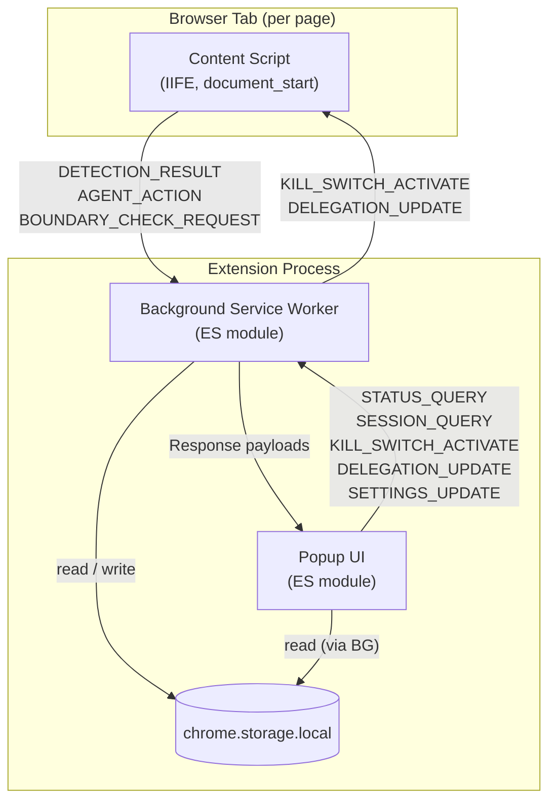
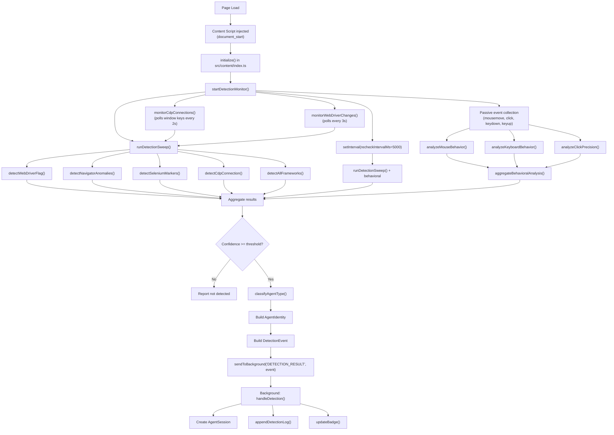
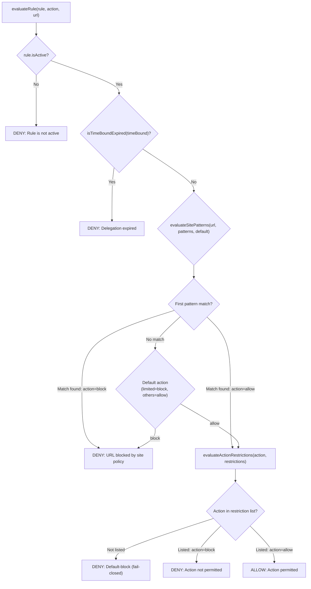
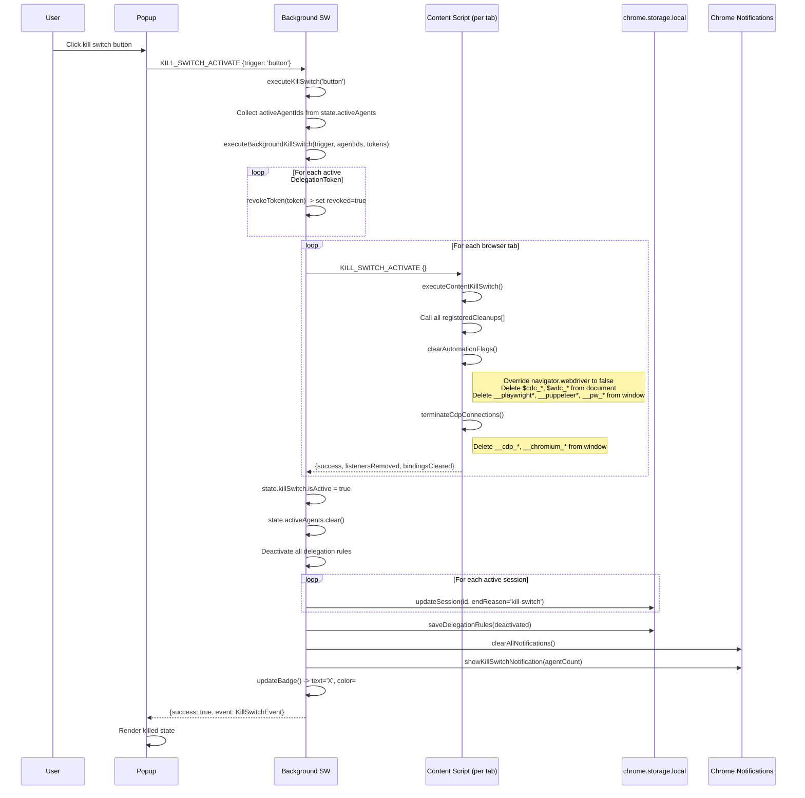

# AI Browser Guard -- Architecture Reference

This document provides a detailed technical walkthrough of the AI Browser Guard Chrome extension for engineers reviewing or contributing to the codebase. It covers the component topology, detection pipeline, message protocol, delegation engine, kill switch mechanism, storage schema, content script lifecycle, security model, and build pipeline.

All file paths are relative to the repository root unless stated otherwise.

---

## 1. System Overview

AI Browser Guard is a Manifest V3 Chrome extension that detects, monitors, and controls AI agents operating in browser sessions. It runs entirely locally with zero external network calls and zero runtime dependencies beyond Chrome APIs.

The extension consists of three isolated execution contexts that communicate exclusively via `chrome.runtime.sendMessage`:

| Context | Entry Point | Format | Runs In |
|---------|------------|--------|---------|
| Content Script | `src/content/index.ts` | IIFE (no ES modules) | Every page (`<all_urls>`, injected at `document_start`) |
| Background Service Worker | `src/background/index.ts` | ES module | Persistent service worker context |
| Popup UI | `src/popup/popup.ts` | ES module (loaded by `popup/index.html`) | Extension popup panel |

Shared state lives in `chrome.storage.local`. There is no shared memory between contexts.



### Permissions

Declared in `manifest.json`:

| Permission | Purpose |
|-----------|---------|
| `activeTab` | Access to the currently active tab for detection |
| `storage` | Persist sessions, rules, settings to `chrome.storage.local` |
| `alarms` | Periodic delegation expiration checks (every 1 minute) |
| `tabs` | Query all tabs to broadcast kill switch / delegation updates |
| `notifications` | Chrome system notifications for boundary violations and kill switch |
| `<all_urls>` (host) | Content script injection on every page for agent detection |

### Keyboard Shortcut

Registered in `manifest.json` under `commands`:

- `kill-switch`: `Ctrl+Shift+K` (Windows/Linux) / `Command+Shift+K` (macOS)

---

## 2. Detection Pipeline

Detection runs inside the content script on every page. The orchestrator is `src/content/detector.ts`, which coordinates four detection layers and produces a `DetectionVerdictResult`.

### Detection Layers

| Layer | Module | Method Enum | What It Checks |
|-------|--------|-------------|----------------|
| WebDriver flag | `src/detection/webdriver.ts` | `webdriver-flag` | `navigator.webdriver` value and property descriptor tampering |
| Navigator anomalies | `src/detection/webdriver.ts` | `automation-flag` | Plugin count, languages array, notification permission defaults |
| Selenium markers | `src/detection/webdriver.ts` | `framework-fingerprint` | `$cdc_*`, `$wdc_*` on `document`; `callSelenium`, `_selenium`, `__nightmare`, `cdc_*` on `window` |
| CDP connection | `src/detection/cdp-patterns.ts` | `cdp-connection` | `__cdp_*`, `__chromium_*` window props; Playwright/Puppeteer evaluation script bindings; `DevToolsAPI` |
| Framework fingerprints | `src/detection/automation.ts` | `framework-fingerprint` | Anthropic Computer Use (`__anthropic_computer_use__`, `__computer_use__`, `__anthropic_tool__`), OpenAI Operator (`__openai_operator__`, `__operator_runtime__`, user-agent strings), generic headless indicators (missing `chrome.loadTimes`, zero outer dimensions, software WebGL renderer) |
| Behavioral analysis | `src/detection/behavioral.ts` | `behavioral-timing`, `behavioral-precision`, `behavioral-typing` | Mouse interval std dev, integer coordinate ratio, synthetic event ratio, click-without-movement count, keyboard interval uniformity, superhuman typing speed, click-to-center precision |

### Flow Diagram



### Confidence Escalation Logic

Located in `runDetectionSweep()` within `src/content/detector.ts`:

1. Each detector returns its own `DetectionConfidence`: `low`, `medium`, `high`, or `confirmed`.
2. The sweep takes the maximum confidence across all positive detections via `maxConfidence()`.
3. If 2 or more signals fire and the max is below `high`, it upgrades to `high`.
4. If 3 or more signals fire and the max is below `confirmed`, it upgrades to `confirmed`.
5. If the overall confidence is below the configured `minimumConfidence` (default: `low`), the result is reported as not-detected.

### Agent Type Classification

`classifyAgentType()` in `src/content/detector.ts` applies a priority order:

1. Framework fingerprint results (most specific -- returns `playwright`, `puppeteer`, `selenium`, `anthropic-computer-use`, `openai-operator`)
2. CDP detection detail string matching (checks for "Playwright" or "Puppeteer" substrings, falls back to `cdp-generic`)
3. WebDriver detection (returns `webdriver-generic`)
4. Behavioral-only detection (returns `unknown`)

### Behavioral Analysis Thresholds

Defined as `BEHAVIORAL_THRESHOLDS` in `src/detection/behavioral.ts`:

| Metric | Threshold | Interpretation |
|--------|-----------|----------------|
| `mouseIntervalStdDevMin` | 15 ms | Std dev below this = uniform (robotic) timing |
| `integerCoordinateRatioMax` | 0.95 | Above this = coordinates are always integers (programmatic) |
| `keyIntervalStdDevMin` | 20 ms | Std dev below this = uniform keystrokes |
| `syntheticEventRatioMax` | 0.50 | Above this = majority of events are `isTrusted: false` |
| `minimumEventsRequired` | 20 | Minimum sample size before analysis runs |

Click precision analysis uses separate thresholds: std dev below 2px and mean offset below 3px from element center indicates automation.

---

## 3. Message Protocol

All inter-context communication uses `chrome.runtime.sendMessage` with a typed `MessagePayload` envelope defined in `src/types/events.ts`.

### Envelope Structure

```typescript
interface MessagePayload {
  type: MessageType;       // Discriminant
  data: unknown;           // Payload (shape depends on type)
  correlationId?: string;  // Optional request-response pairing
  sentAt: string;          // ISO 8601 timestamp
}
```

### Message Types and Data Shapes

| Type | Direction | Data Shape | Async Response? |
|------|-----------|-----------|-----------------|
| `DETECTION_RESULT` | Content -> Background | `DetectionEvent` | Yes (`{ success: boolean }`) |
| `AGENT_ACTION` | Content -> Background | `AgentEvent` | No |
| `BOUNDARY_CHECK_REQUEST` | Content -> Background | `BoundaryViolation` | No |
| `KILL_SWITCH_ACTIVATE` | Popup -> Background, Background -> Content | `{ trigger: string }` | Yes (Background returns `KillSwitchEvent`) |
| `DELEGATION_UPDATE` | Popup -> Background, Background -> Content | `DelegationRule \| null` | Yes |
| `SESSION_QUERY` | Popup -> Background | `{}` | Yes (`{ sessions: AgentSession[] }`) |
| `STATUS_QUERY` | Popup -> Background, Content -> Background | `{}` | Yes (returns current state snapshot) |
| `SETTINGS_UPDATE` | Popup -> Background | `Partial<UserSettings>` | Yes |

### Response Protocol

The `handleMessage()` function in `src/background/index.ts` returns `true` from the listener when it will respond asynchronously (using `sendResponse` inside a `.then()` chain), and `false` for synchronous responses. This follows the Chrome extension messaging contract where returning `true` keeps the message channel open.

### Broadcast Pattern

For `KILL_SWITCH_ACTIVATE` and `DELEGATION_UPDATE`, the background service worker broadcasts to all tabs:

```typescript
const tabs = await chrome.tabs.query({});
for (const tab of tabs) {
  if (tab.id === undefined) continue;
  try {
    await chrome.tabs.sendMessage(tab.id, { type, data, sentAt });
  } catch {
    // Tab may not have content script injected
  }
}
```

This is fire-and-forget per tab. Tabs without content scripts (e.g., `chrome://` pages) silently fail.

---

## 4. Delegation Engine

The delegation engine controls what actions an agent is permitted to perform. It is implemented across two files:

- `src/delegation/rules.ts` -- Rule creation, evaluation, site pattern matching, action restriction checks
- `src/types/delegation.ts` -- Type definitions for `DelegationRule`, `DelegationScope`, `DelegationPreset`, `SitePattern`, `ActionRestriction`, `TimeBound`, `DelegationToken`

### Presets

Three built-in presets map to capability sets defined in `src/delegation/rules.ts`:

| Preset | Capabilities | Site Default | Time Bound |
|--------|-------------|--------------|------------|
| `readOnly` | `navigate`, `read-dom` | Allow all | None |
| `limited` | `navigate`, `read-dom`, `click`, `type-text` | Block all (allowlist required) | Required (15m / 1hr / 4hr) |
| `fullAccess` | All 11 capabilities | Allow all | None |

The full capability set (`ALL_CAPABILITIES`): `navigate`, `read-dom`, `click`, `type-text`, `submit-form`, `download-file`, `open-tab`, `close-tab`, `screenshot`, `execute-script`, `modify-dom`.

### Evaluation Flow

`evaluateRule()` in `src/delegation/rules.ts`:



### Key Design Decisions

**Fail-closed**: The `checkBoundary()` function in `src/content/monitor.ts` blocks all actions when no delegation rule is active:

```typescript
if (!rule) {
  return {
    allowed: false,
    matchedRule: null,
    reason: 'No active delegation rule. All actions are blocked by default.',
  };
}
```

**First-match site patterns**: `evaluateSitePatterns()` iterates the `sitePatterns` array in order and returns the first match. If no pattern matches, the default action is determined by the preset (`limited` defaults to `block`; `readOnly` and `fullAccess` default to `allow`).

**Glob matching**: `matchGlob()` converts glob patterns to regex. For hostname-only patterns (no `://`), `*` matches `[^.]*` (single subdomain segment) and `**` matches `.*` (any number of segments). For full URL patterns, `*` maps to `.*`.

**Single active rule**: Only one delegation rule can be active at a time. When a new rule is activated via `handleDelegationUpdate()` in the background, all existing rules are deactivated first.

### Delegation Token

`DelegationToken` (created by `issueToken()` in `src/delegation/rules.ts`) is a local-only, unsigned structure. It includes reserved fields for future AIM integration:

- `signature?: string` -- reserved for cryptographic signing
- `issuer?: string` -- reserved for AIM instance identifier

---

## 5. Kill Switch Mechanism

The kill switch provides one-click revocation of all agent access. Implementation is in `src/killswitch/index.ts`.

### Activation Triggers

1. Popup button click (`trigger: 'button'`)
2. Keyboard shortcut `Ctrl+Shift+K` / `Cmd+Shift+K` (`trigger: 'keyboard-shortcut'`)
3. Programmatic API call (`trigger: 'api'`)

### Execution Sequence



### Content-Side Cleanup

`executeContentKillSwitch()` performs three operations:

1. **Registered cleanups**: Calls every function added via `registerCleanup()`. The detection monitor and boundary monitor both register their teardown logic (clearing intervals, removing event listeners, disconnecting MutationObservers).

2. **Automation flag clearing** (`clearAutomationFlags()`):
   - Overrides `navigator.webdriver` getter to return `false`
   - Deletes Selenium markers (`$cdc_*`, `$wdc_*`) from `document`
   - Deletes Playwright/Puppeteer bindings (`__playwright*`, `__puppeteer*`, `__pw_*`) from `window`

3. **CDP termination** (`terminateCdpConnections()`):
   - Deletes `__cdp_*` and `__chromium_*` properties from `window`
   - Best-effort; properties may not be deletable

### Notification

The kill switch shows a Chrome notification via `showKillSwitchNotification()` with `priority: 2` and auto-dismisses after 5 seconds.

---

## 6. Storage Schema

All persistent data is stored in `chrome.storage.local`. The top-level schema is defined as `StorageSchema` in `src/session/types.ts`.

### Schema Definition

```typescript
interface StorageSchema {
  sessions: AgentSession[];       // Last 5 sessions, newest first
  delegationRules: DelegationRule[]; // All delegation rules (only one active)
  settings: UserSettings;          // User preferences
  detectionLog: DetectionEvent[];  // Last 100 detection events
}
```

### Retention Policies

| Key | Max Entries | Eviction Strategy | Enforced By |
|-----|-------------|-------------------|-------------|
| `sessions` | 5 (configurable via `settings.maxSessions`) | Oldest sessions dropped when limit exceeded | `saveSession()` in `src/session/storage.ts` |
| `detectionLog` | 100 (configurable via `settings.maxDetectionLogEntries`) | Oldest entries spliced from front of array | `appendDetectionLog()` in `src/session/storage.ts` |
| `delegationRules` | Unbounded | N/A | N/A |
| `settings` | Single object | Partial merge on update | `updateSettings()` in `src/session/storage.ts` |

### Session Lifecycle

```
AgentSession created (handleDetection)
  -> events appended (handleAgentAction, handleBoundaryViolation)
  -> session ended with endReason:
     - 'kill-switch' (kill switch activated)
     - 'page-unload' (tab closed)
     - 'agent-disconnected' (stale session on SW restart)
     - 'delegation-expired' (time bound reached)
```

### Data Types in Storage

**AgentSession** (`src/session/types.ts`):
- `id`: UUID v4
- `agent`: `AgentIdentity` (type, confidence, detection methods, origin URL)
- `delegationRule`: Active rule at session start, or null
- `events`: `AgentEvent[]` (chronological timeline)
- `startedAt` / `endedAt`: ISO 8601 timestamps
- `endReason`: One of 4 termination reasons or null
- `summary`: Pre-computed `SessionSummary` (total/allowed/blocked actions, violations, top URLs, duration)

**UserSettings** (`src/session/types.ts`):

| Setting | Type | Default |
|---------|------|---------|
| `detectionEnabled` | `boolean` | `true` |
| `notificationsEnabled` | `boolean` | `true` |
| `killSwitchShortcut` | `string` | `'Ctrl+Shift+K'` |
| `maxSessions` | `number` | `5` |
| `maxDetectionLogEntries` | `number` | `100` |
| `autoBlockUnknownAgents` | `boolean` | `false` |

### Storage Access Pattern

All storage operations go through `src/session/storage.ts`, which wraps `chrome.storage.local` with:

- `getStorageState()` -- reads all keys, fills missing with defaults
- `saveSession()` -- prepends new session, enforces limit
- `updateSession()` -- finds by ID, applies updater function
- `appendDetectionLog()` -- appends, trims from front if over limit
- `updateSettings()` -- partial merge with existing settings
- `clearAllStorage()` -- full wipe

Every function wraps Chrome API calls in try/catch and logs errors to console with `[AI Browser Guard]` prefix.

---

## 7. Content Script Lifecycle

### Injection Timing

Declared in `manifest.json`:

```json
"content_scripts": [{
  "matches": ["<all_urls>"],
  "js": ["dist/content/index.js"],
  "run_at": "document_start"
}]
```

The content script is injected at `document_start`, before the DOM is constructed. This is critical for detection because it allows the extension to observe the page environment before automation frameworks have a chance to clean up their traces.

### Initialization Sequence

`initialize()` in `src/content/index.ts`:

1. Register `chrome.runtime.onMessage` listener for incoming messages from background.
2. Wait for `DOMContentLoaded` (or run immediately if document is already loaded).
3. Start `startDetectionMonitor()` from `src/content/detector.ts`:
   - Runs an immediate synchronous detection sweep (`runDetectionSweep()`)
   - Sets up periodic re-checks every 5 seconds
   - Registers passive event listeners for behavioral data collection (`mousemove`, `click`, `keydown`, `keyup` -- all with `{ passive: true, capture: true }`)
   - Starts CDP connection monitoring (polls `window` property names every 2 seconds)
   - Starts WebDriver flag monitoring (polls `navigator.webdriver` every 3 seconds)
4. Start `startBoundaryMonitor()` from `src/content/monitor.ts` with `rule: null` (fail-closed until delegation is received):
   - Registers capturing-phase listeners on `click`, `input`, `submit`, `keydown`
   - Creates a `MutationObserver` on `document.body` for DOM modifications
   - Only intercepts synthetic events (`e.isTrusted === false`); trusted (human) events pass through
5. Register both monitor cleanup functions with `registerCleanup()` for kill switch teardown.
6. Send `STATUS_QUERY` to background to retrieve any active delegation rule.

### Performance Considerations

- **Passive listeners**: Behavioral data collectors use `{ passive: true }` to avoid blocking scroll and input.
- **Capture phase**: Both boundary monitoring and behavioral collection use `{ capture: true }` to intercept events before they reach page scripts.
- **Buffer limits**: Behavioral event buffers are capped at `behavioralSampleSize * 3` (default: 60 events). Excess events are shifted from the front.
- **Violation cap**: The monitor's `recentViolations` array is capped at 50 entries.
- **Minimal memory footprint**: No external dependencies; all logic is inline TypeScript compiled to a single IIFE bundle.
- **Detection polling**: The 5-second recheck interval, 2-second CDP monitor, and 3-second WebDriver monitor use `setInterval`. All are cleared on cleanup.

### Content Script Isolation

Content scripts run in an isolated world. They share the DOM with the page but have a separate JavaScript context. This means:

- `window` property enumeration (`Object.getOwnPropertyNames(window)`) sees the page's globals, enabling detection of automation bindings.
- Event listeners registered in the content script's capture phase fire before page-level handlers.
- `navigator.webdriver` is accessible because it is on the shared `navigator` object.

---

## 8. Security Model

### Fail-Closed Design

The delegation engine's default posture is deny-all:

1. **No rule active**: `checkBoundary()` returns `allowed: false` with reason "No active delegation rule."
2. **Rule inactive**: Returns `allowed: false`.
3. **Rule expired**: `isTimeBoundExpired()` checks against current time; returns `allowed: false` if past `expiresAt`.
4. **Action not listed**: `evaluateActionRestrictions()` returns `allowed: false` if the capability is not in the restriction list.
5. **Limited preset default**: Site patterns default to `block` for the `limited` preset, requiring explicit allowlisting.

### No External Network Calls

AI Browser Guard makes zero outbound network requests. All detection, evaluation, and storage happens locally using Chrome APIs. The `manifest.json` does not declare any network-related permissions beyond `<all_urls>` host permissions (which are used solely for content script injection, not for `fetch` or `XMLHttpRequest`).

### Content Security Policy Compliance

- The content script is bundled as IIFE (no dynamic imports, no `eval`).
- The popup loads a local HTML file with inline script reference (`popup.js`), compliant with MV3 CSP restrictions.
- The background service worker uses ES modules, which are permitted in MV3 service workers.
- No `unsafe-eval` or `unsafe-inline` is required.

### Content Script Isolation

Content scripts execute in a Chrome-managed isolated world:

- Page scripts cannot access content script variables or functions.
- The content script can read page-level `window` properties (for detection) but cannot be tampered with by page JavaScript.
- `e.isTrusted` is a read-only property set by the browser engine, not spoofable by page scripts. The boundary monitor relies on this to distinguish human vs. synthetic events.

### Storage Security

- `chrome.storage.local` is scoped to the extension's origin and cannot be read by page scripts or other extensions.
- Session data, delegation rules, and detection logs never leave the browser.
- No encryption is applied to stored data (it is protected by Chrome's extension storage isolation).

### Kill Switch Resilience

- The kill switch broadcasts to all tabs independently. A failure in one tab does not prevent cleanup in others.
- Content-side cleanup is best-effort: if a property cannot be deleted (e.g., non-configurable), the operation silently continues.
- The background service worker clears its in-memory state (`activeAgents`, `activeSessions`, delegation rules) regardless of content script outcomes.

### Sensitive URL Detection

`classifyViolationSeverity()` in `src/alerts/boundary.ts` upgrades alert severity for URLs matching sensitive patterns:

```
/\.bank\./i, /\.gov\./i, /paypal/i, /stripe/i, /\.financial/i, /healthcare/i, /\.mil\./i
```

When a violation occurs on a sensitive URL, severity is upgraded by one level (e.g., `medium` becomes `high`, `high` becomes `critical`).

### One-Time Override Controls

Only violations classified as `medium` or `low` severity allow a one-time user override. `critical` and `high` severity violations cannot be overridden, ensuring that dangerous actions on sensitive sites are always blocked.

---

## 9. Build Pipeline

The build system uses Vite 5 with three separate build passes. This is necessary because Chrome content scripts cannot use ES module imports (no shared chunks), while the background service worker and popup can.

### Build Script

`scripts/build.js` orchestrates the build:

1. Delete the `dist/` directory.
2. Build each entry point sequentially via `ENTRY=<name> npx vite build`:
   - `content` -- IIFE format
   - `background` -- ES module format
   - `popup` -- Standard HTML entry with Rollup
3. Copy and rewrite `manifest.json` into `dist/` with corrected paths.
4. Copy icons (`icons/icon16.png`, `icons/icon48.png`, `icons/icon128.png`) to `dist/icons/`.
5. Copy fonts (`fonts/inter-latin.woff2`) to `dist/fonts/`.

### Vite Configuration

`vite.config.ts` uses the `ENTRY` environment variable to produce different configurations:

| Entry | Format | Output | Special Config |
|-------|--------|--------|----------------|
| `content` | IIFE (`lib.formats: ['iife']`) | `dist/content/index.js` | Global name: `AIBrowserGuardContent`. No shared chunks. |
| `background` | ES (`lib.formats: ['es']`) | `dist/background/index.js` | `inlineDynamicImports: true` to avoid chunk splitting. |
| `popup` | Standard Rollup HTML | `dist/popup/index.html`, `dist/popup/popup.js`, `dist/popup/styles.css` | Root set to `src/popup`. Asset names mapped for predictable output. |

### Shared Build Settings

All three entries share:

```typescript
{
  target: 'es2022',
  minify: false,
  sourcemap: 'inline',
}
```

`minify: false` keeps the output readable for Chrome Web Store review. Inline sourcemaps support debugging in Chrome DevTools.

### TypeScript Configuration

`tsconfig.json`:

- `target: ES2022`, `module: ES2022`
- `strict: true` -- all strict checks enabled
- `lib: ["ES2022", "DOM", "DOM.Iterable"]`
- `types: ["chrome", "vitest/globals"]` -- Chrome API types from `@types/chrome`
- `noEmit: true` -- TypeScript is only used for type checking; Vite handles compilation
- Path alias: `@/*` maps to `src/*`

### NPM Scripts

| Script | Command | Purpose |
|--------|---------|---------|
| `build` | `tsc --noEmit && node scripts/build.js` | Type check, then build all entries |
| `dev` | `vite build --watch --mode development` | Watch mode |
| `test` | `vitest run` | Run test suite once |
| `test:watch` | `vitest` | Run tests in watch mode |
| `lint` | `tsc --noEmit --strict` | Type-only linting |

### Manifest Path Rewriting

The build script reads `manifest.json` from the project root and rewrites paths for `dist/` as the extension root:

| Field | Source Value | Rewritten Value |
|-------|-------------|-----------------|
| `background.service_worker` | `dist/background/index.js` | `background/index.js` |
| `content_scripts[0].js[0]` | `dist/content/index.js` | `content/index.js` |
| `action.default_popup` | `dist/popup/index.html` | `popup/index.html` |

Icon paths (`icons/icon16.png`, etc.) remain unchanged because the icons are copied into `dist/icons/`.

---

## Appendix: Type Reference

### Core Types (src/types/)

**`AgentType`**: `'playwright' | 'puppeteer' | 'selenium' | 'anthropic-computer-use' | 'openai-operator' | 'cdp-generic' | 'webdriver-generic' | 'unknown'`

**`DetectionMethod`**: `'cdp-connection' | 'webdriver-flag' | 'automation-flag' | 'behavioral-timing' | 'behavioral-precision' | 'behavioral-typing' | 'framework-fingerprint' | 'synthetic-event'`

**`DetectionConfidence`**: `'confirmed' | 'high' | 'medium' | 'low'`

**`AgentCapability`**: `'navigate' | 'read-dom' | 'click' | 'type-text' | 'submit-form' | 'download-file' | 'open-tab' | 'close-tab' | 'screenshot' | 'execute-script' | 'modify-dom'`

**`DelegationPreset`**: `'readOnly' | 'limited' | 'fullAccess'`

**`AgentEventType`**: `'detection' | 'action-allowed' | 'action-blocked' | 'boundary-violation' | 'delegation-granted' | 'delegation-revoked' | 'kill-switch-activated' | 'session-start' | 'session-end'`

**`MessageType`**: `'DETECTION_RESULT' | 'AGENT_ACTION' | 'BOUNDARY_CHECK_REQUEST' | 'BOUNDARY_CHECK_RESPONSE' | 'KILL_SWITCH_ACTIVATE' | 'KILL_SWITCH_RESULT' | 'DELEGATION_UPDATE' | 'SESSION_QUERY' | 'SESSION_DATA' | 'STATUS_QUERY' | 'STATUS_RESPONSE' | 'SETTINGS_UPDATE'`

**`AlertSeverity`**: `'critical' | 'high' | 'medium' | 'low'`

### Future Integration Points

The type system includes reserved fields for future product integrations:

| Field | Type | Location | Purpose |
|-------|------|----------|---------|
| `AgentIdentity.trustScore` | `number?` | `src/types/agent.ts` | AIM registry trust lookup (0.0--1.0) |
| `AgentIdentity.label` | `string?` | `src/types/agent.ts` | AIM registry human-readable name |
| `DelegationToken.signature` | `string?` | `src/types/delegation.ts` | Cryptographic token signing via AIM |
| `DelegationToken.issuer` | `string?` | `src/types/delegation.ts` | AIM instance identifier |
